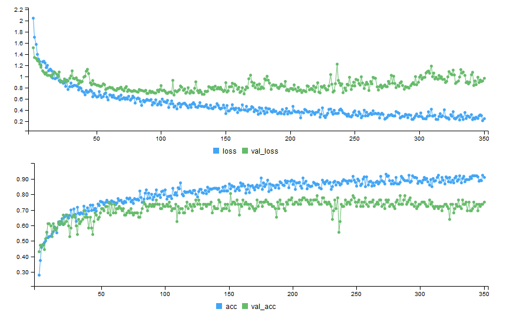

```{r setup, include=FALSE}
options(htmltools.dir.version = FALSE)
```

```{r xaringan-themer, include=FALSE}
library(xaringanthemer)
mono_accent(
  #header_font_google =  google_font("Play"),
  code_font_family = "Fira Code",
  code_font_url    = "https://cdn.rawgit.com/tonsky/FiraCode/1.204/distr/fira_code.css",
  text_font_google = google_font("Ubuntu")
)
```

class: center, middle
background-color: #8d6e63

#Disclaimer

Цель доклада не дать понимаение что такое глубокое обучение и детально разобрать как работать с ним и обучать современные модели, а скорее показать как просто можно начать тем, кто давно хотел и чесались руки, но все было никак не взяться

---
# Deep Learning
## Что это?
--

* Когда у нас есть исскуственная нейронная сеть

--

* Когда скрытых слоев в этой сети больше чем два

--


.footnotes[[1] https://machinelearningmastery.com/what-is-deep-learning/]

---

## Как это математически


???

На самом деле это конечно самый простой юнит, самый базовый.

---
background-image: url(https://3qeqpr26caki16dnhd19sv6by6v-wpengine.netdna-ssl.com/wp-content/uploads/2016/08/Why-Deep-Learning-1024x742.png)

???

Image credit: [Andrew Ng](http://www.slideshare.net/ExtractConf)


---
class: inverse, center, middle, title-slide

# Frameworks
---

.footnotes[
[1] https://towardsdatascience.com/deep-learning-framework-power-scores-2018-23607ddf297a
]
---
## Нас интересуют только те, что есть в R через API

--
* ###TensorFlow

--
* ###theano 

--
* ###Keras 

--
* ###CNTK 

--
* ###MXNet 

--
* ###ONNX 

---
## Есть еше несколько пакетов

* darch (removed from cran)

* deepnet

* deepr

* H2O (interface) ([Tutorial](https://htmlpreview.github.io/?https://github.com/ledell/sldm4-h2o/blob/master/sldm4-deeplearning-h2o.html))


???
Вода это по большей части МЛ фреймворк, с недавних пор, где появился модуль про глубокое обучение. Есть неплохой туториал для р пакета. Умеет в поиск гиперпараметров, кроссвалидацию и прочие нужные для МЛ штуки для сеток, очевидно это работает только для маленьких сетей)

Но они р специфичны, кроме воды, и соотвественно медленные, да и умеют довольно мало. Новые годные архитектуры сетей туда не имплементированы.

---


https://www.tensorflow.org/

https://tensorflow.rstudio.com/

- Делает Google

- Самый популярный, имеет тучу туториалов и книг

- Имеет самый большой спрос у продакшн систем

- Имеет API во множестве языков

- Имеет статический граф вычислений, что бывает неудобно, зато оптимизированно

- Примерно с лета имеет фичу **eager execution**, который почти нивелирует это неудобство. Но почти не считается

- Доступен в R как самостоятельно, так и как бэкэнд Keras

---


http://www.deeplearning.net/software/theano/

- Делался силами университета Монреаль с 2007

- Один из самый старых фреймворков, но почти почил в забытьи

- Придумали идею абстракции вычислительных графов (статических) для оптимизации и вычисления нейронных сетей

- В R доступен как бэкенд через Keras

---


https://cntk.ai/

- Делается силами Майкрософт

- Имеет половинчатые динамические вычислительные графы (на самом деле динамические тензоры скорее)

- Доступен как бэкенд Keras так и как самостоятельный бэкенд с биндингами в R через reticulate package, что значит нужно иметь python версию фреймворка

---


https://keras.io/

https://keras.rstudio.com/

https://tensorflow.rstudio.com/keras/

- Высокоуровневый фреймворк над другими такими бэкэндами как Theano, CNTK, Tensorflow, и еще некоторые на подходе
- Делается Франсуа Шолле, который написал книгу Deep Learning in R
- Очень простой код
- Один и тот же код рабоает на разных бэкендах, что теоретически может быть полезно (нет)
- Есть очень много блоков нейросетей из современных SOTA работ
- Нивелирует боль статических вычислительных графов
- Уже давно дефолтом поставляется вместе с TensorFlow как его часть, но можно использовать и отдельно


---


https://mxnet.apache.org/

https://github.com/apache/incubator-mxnet/tree/master/R-package

- Является проектом Apache

- Сочетает в себе динамические и статические графы

- Тоже имеет зоопарк предобученных моделей

- Как и TensorFlow поддерживается многими языками, что может быть очень полезно

- Довольно разумный и хороший фреймворк, непонятно, почему не пользуется популярностью


---


https://onnx.ai/

https://onnx.ai/onnx-r/

- Предоставляет открытый формат представления вычислительных графов, чтобы можно было обмениваться запускать одни и теже, экспортированные в этот формат, модели с помощью разных фреймворков и своего рантайма

- Можно работать из R

- Изначально делался Microsoft вместе с Facebook

- Поддерживает кучу фреймворков нативно и конвертацию в ML и TF, Keras


---
class: inverse, middle, center

# Deep Learning with MXNet

---

## Установка 
В Windows и MacOS в R
```{r eval=FALSE}
# Windows and MacOs 
cran <- getOption("repos")
cran["dmlc"] <- "https://apache-mxnet.s3-accelerate.dualstack.amazonaws.com/R/CRAN/GPU/cu92"
options(repos = cran)
install.packages("mxnet")
```

Linux bash
```{bash eval=FALSE}
# On linux
git clone --recursive https://github.com/apache/incubator-mxnet.git mxnet
cd mxnet/docs/install
./install_mxnet_ubuntu_python.sh
./install_mxnet_ubuntu_r.sh

cd incubator-mxnet
make rpkg
```
---

## Загрузка и обработка данных
```{r eval=FALSE}
df <- read_csv("data.csv")
set.seed(100)
```

```{r}
#transform and split train on x and y
train_ind <- sample(1:77, 60)
x_train <- as.matrix(df[train_ind, 2:8])
y_train <- unlist(df[train_ind, 9])
x_val <- as.matrix(df[-train_ind, 2:8])
y_val <- unlist(df[-train_ind, 9])
```

---
## Задания архитектуры сети

```{r require(mxnet)}
require(mxnet)
# define graph
data <- mx.symbol.Variable("data")

fc1 <- mx.symbol.FullyConnected(data, num_hidden = 1)

linreg <- mx.symbol.LinearRegressionOutput(fc1)

# define learing parameters
initializer <- mx.init.normal(sd = 0.1)

optimizer <- mx.opt.create("sgd", 
                           learning.rate = 1e-6,
                           momentum = 0.9)
# define logger

logger <- mx.metric.logger()
epoch.end.callback <- mx.callback.log.train.metric(
  period = 4, # число батчей, после которого оценивается метрика
  logger = logger)

# num of epoch
n_epoch <- 20

```

---
## Построим граф модели
```{r eval=FALSE}
# plot our model
graph.viz(linreg)
```


---
## Обучим
```{r tidy=FALSE}
model <- mx.model.FeedForward.create(
  symbol = linreg, # our model
  X = x_train, # our data
  y = y_train, # our label
  ctx = mx.cpu(), # engine
  num.round = n_epoch, 
  initializer = initializer, # inizialize weigths
  optimizer = optimizer, # sgd optimizer
  eval.data = list(data = x_val, label = y_val), # evaluation on evey epoch
  eval.metric = mx.metric.rmse, # metric
  array.batch.size = 15, 
  epoch.end.callback = epoch.end.callback) # logger

```

---
## Построим кривую обучения
```{r fig.height=4, dev='svg'}
rmse_log <- data.frame(RMSE = c(logger$train, logger$eval),dataset = c(rep("train", length(logger$train)),                        rep("val", length(logger$eval))),epoch = 1:n_epoch)
library(ggplot2)
ggplot(rmse_log, aes(epoch, RMSE, group = dataset, colour = dataset)) +  geom_point() +  geom_line()

```

---
class: inverse, center, middle
# Deep Learning with Keras

---
## Установка
```{r eval=FALSE}
install.packages("keras")
keras::install_keras(tensorflow = 'gpu')
```
### Загрузка нужных нам пакетов
```{r}
require(keras)     # Neural Networks
require(tidyverse) # Data cleaning / Visualization
require(knitr)     # Table printing
require(rmarkdown) # Misc. output utilities 
require(ggridges)  # Visualization
```

---
## Загрузка данных
```{r}
activityLabels <- read.table("Deep_Learning_in_R_files/HAPT Data Set/activity_labels.txt", 
                             col.names = c("number", "label")) 
activityLabels %>% kable(align = c("c", "l"))
```

---
```{r}
labels <- read.table("Deep_Learning_in_R_files/HAPT Data Set/RawData/labels.txt",
                     col.names = c("experiment", "userId", "activity", "startPos", "endPos"))
dataFiles <- list.files("Deep_Learning_in_R_files/HAPT Data Set/RawData")
labels %>% 
  head(50) %>% 
  paged_table()
```

---
## TLDR
```{r eval=FALSE}
allObservations <- read_rds("allObservations.rds")
allObservations %>% dim()
```

---
## Посмотрим на данные
```{r fig.height=4, dev='svg'}
allObservations %>% 
  mutate(recording_length = map_int(data,nrow)) %>% 
  ggplot(aes(x = recording_length, y = activityName)) +
  geom_density_ridges(alpha = 0.8)
```

---
## Отфильтруем
```{r fig.height=4}
desiredActivities <- c("STAND_TO_SIT", "SIT_TO_STAND", "SIT_TO_LIE",  "LIE_TO_SIT", "STAND_TO_LIE","LIE_TO_STAND")
filteredObservations <- allObservations %>% 
  filter(activityName %in% desiredActivities) %>% 
  mutate(observationId = 1:n())
filteredObservations %>% paged_table()
```

---
## Разделим на трейн тест
```{r}
set.seed(100) # seed for reproducibility

## get all users
userIds <- allObservations$userId %>% unique()

## randomly choose 24 (80% of 30 individuals) for training
trainIds <- sample(userIds, size = 24)

## set the rest of the users to the testing set
testIds <- setdiff(userIds,trainIds)

## filter data. 
trainData <- filteredObservations %>% 
  filter(userId %in% trainIds)

testData <- filteredObservations %>% 
  filter(userId %in% testIds)

```

---
layout: true
## Посмотрим собственно на активности по классам

---

```{r eval=FALSE}
unpackedObs <- 1:nrow(trainData) %>% 
  map_df(function(rowNum){
    dataRow <- trainData[rowNum, ]
    dataRow$data[[1]] %>% 
      mutate(
        activityName = dataRow$activityName, 
        observationId = dataRow$observationId,
        time = 1:n() )
  }) %>% 
  gather(reading, value, -time, -activityName, -observationId) %>% 
  separate(reading, into = c("type", "direction"), sep = "_") %>% 
  mutate(type = ifelse(type == "a", "acceleration", "gyro"))
```
---
```{r fig.height=4}
unpackedObs %>% 
  ggplot(aes(x = time, y = value, color = direction)) +
  geom_line(alpha = 0.2) +
  geom_smooth(se = FALSE, alpha = 0.7, size = 0.5) +
  facet_grid(type ~ activityName, scales = "free_y") +
  theme_minimal() +
  theme( axis.text.x = element_blank() )
```

---
layout: true
## Подготовка данных к обучению

---
```{r}
padSize <- trainData$data %>% 
  map_int(nrow) %>% 
  quantile(p = 0.98) %>% 
  ceiling()
padSize

convertToTensor <- . %>% 
  map(as.matrix) %>% 
  pad_sequences(maxlen = padSize)

trainObs <- trainData$data %>% convertToTensor()
testObs <- testData$data %>% convertToTensor()

dim(trainObs)
```

---
```{r}
# one hot encoding
oneHotClasses <- . %>% 
{. - 7} %>%        # bring integers down to 0-6 from 7-12
  to_categorical() # One-hot encode

trainY <- trainData$activity %>% oneHotClasses()
testY <- testData$activity %>% oneHotClasses()
```

---
layout:true
## Наконец то сетка!

---
```{r}
input_shape <- dim(trainObs)[-1]
num_classes <- dim(trainY)[2]

filters <- 24     # number of convolutional filters to learn
kernel_size <- 8  # how many time-steps each conv layer sees.
dense_size <- 48  # size of our penultimate dense layer. 

```

---
```{r}
model <- keras_model_sequential()
model %>% layer_conv_1d(
    filters = filters,
    kernel_size = kernel_size, 
    input_shape = input_shape,
    padding = "valid", 
    activation = "relu") %>%
  layer_batch_normalization() %>%
  layer_spatial_dropout_1d(0.15) %>% 
  layer_conv_1d(filters = filters/2,
    kernel_size = kernel_size,
    activation = "relu") %>%
  layer_global_average_pooling_1d() %>% 
  layer_batch_normalization() %>%
  layer_dropout(0.2) %>% 
  layer_dense(dense_size,
    activation = "relu") %>% 
  layer_batch_normalization() %>%
  layer_dropout(0.25) %>% 
  layer_dense(num_classes, 
    activation = "softmax",
    name = "dense_output") 
```

---
### Выведем описание нашей сетки
```{r eval=FALSE}
summary(model)
```

---
layout:true
## Обучим же наконец

---
## Компиляция графа
```{r eval=FALSE}
model %>% compile(
  loss = "categorical_crossentropy",
  optimizer = "rmsprop",
  metrics = "accuracy"
)
```

---
## train
```{r eval=FALSE}
trainHistory <- model %>%
  fit(
    x = trainObs, y = trainY, # data
    epochs = 350, # num epoch
    validation_data = list(testObs, testY), # validation tests on each epoch
    callbacks = list( 
      callback_model_checkpoint("best_model.h5", 
                                save_best_only = TRUE))) # update train history and save model
```

---


---


---
layout:true
## Предсказание

---
## Подготовка теста
```{r}
oneHotToLabel <- activityLabels %>% 
  mutate(number = number - 7) %>% 
  filter(number >= 0) %>% 
  mutate(class = paste0("V",number + 1)) %>% 
  select(-number)
```
## Выбор лучшей модели
```{r}
bestModel <- load_model_hdf5("best_model.h5")
```

---
## Еще немного кода
```{r}
tidyPredictionProbs <- bestModel %>% 
  predict(testObs) %>% 
  as_data_frame() %>% 
  mutate(obs = 1:n()) %>% 
  gather(class, prob, -obs) %>% 
  right_join(oneHotToLabel, by = "class")

predictionPerformance <- tidyPredictionProbs %>% 
  group_by(obs) %>% 
  summarise(
    highestProb = max(prob),
    predicted = label[prob == highestProb]
  ) %>% 
  mutate(
    truth = testData$activityName,
    correct = truth == predicted
  ) 
```

---
```{r}
predictionPerformance %>% paged_table()
```

---
layout:true
## Визуализация ошибок

---
```{r fig.height=4}
predictionPerformance %>% 
  mutate(result = ifelse(correct, 'Correct', 'Incorrect')) %>% 
  ggplot(aes(highestProb)) +
  geom_histogram(binwidth = 0.01) +
  geom_rug(alpha = 0.5) +
  facet_grid(result~.) +
  ggtitle("Probabilities associated with prediction by correctness")

```

---
```{r fig.height=4}
predictionPerformance %>% 
  group_by(truth, predicted) %>% 
  summarise(count = n()) %>% 
  mutate(good = truth == predicted) %>% 
  ggplot(aes(x = truth,  y = predicted)) +
  geom_point(aes(size = count, color = good)) +
  geom_text(aes(label = count), 
            hjust = 0, vjust = 0, 
            nudge_x = 0.1, nudge_y = 0.1) + 
  guides(color = FALSE, size = FALSE) +
  theme_minimal()
```

---
layout:false
class: inverse, middle, center
# Заключение

---
background-image: url(https://images.manning.com/720/960/resize/book/a/4e5e97f-4e8d-4d97-a715-f6c2b0eb95f5/Allaire-DLwithR-HI.png)


---
class: center, middle

# Спасибо!

Слайды сделаны с помощью R package [**xaringan**](https://github.com/yihui/xaringan).

Веб версию слайдов можно найти на https://metya.github.io/DeepLearning_n_R/

Код можно посмотреть здесь 
https://github.com/metya/DeepLearning_n_R/
